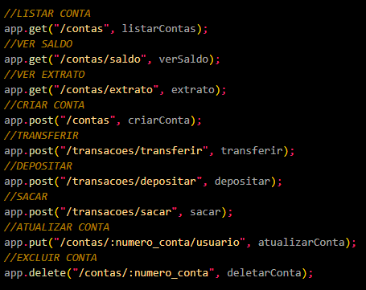

<h1> SISTEMA BANCÁRIO </h1>

 Este projeto foi desenvolvido como desafio de API REST do módulo 2 no curso de desenvolvimento backend da Cubos Academy. 

<h3> Foram usadas as seguintes tecnologias: </h3>
<li>JavaScript</li>
<li>NodeJS</li>
<li>NPM</li>
<li>Nodemon</li>
<li>Express</li>
<li>Insomnia</li>
<li>JSON</li>
<li>Verbos HTTP</li>

<h3>Rotas/funcionalidades do projeto:</h3>
<li>Listar contas bancárias cadastradas</li>
<li>Criar nova conta bancária</li>
<li>Atualizar dados de uma conta bancária existente</li>
<li>Deletar uma conta existente</li>
<li>Realizar depósito, saque e transferência</li>
<li>Consultar saldo e extrato</li>

<h3>Para executar o projeto:</h3>
<li>Clonar o repositório com 'git clone'</li>
<li>Abrir o projeto no VSCODE ou editor de código de sua preferência</li>
<li>No terminal, instalar pacotes com o 'npm i'</li>
<li>Executá-lo com o comando 'npm run dev'</li>
<li>No aplicativo Insomnia, criar as rotas como na primeira imagem, seguindo os verbos e rotas da segunda imagem</li>
<li>Então agora você poderá testar as funcionalidades da API de Sistema Bancário</li>

 
